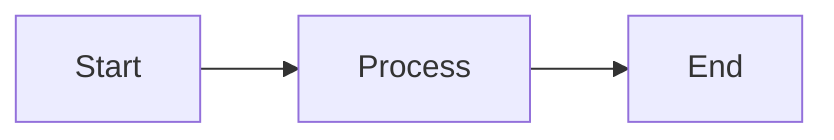

# Documentation Setup Guide

This document explains the Material for MkDocs documentation setup for the Sensor Health Dashboard project.

## What Was Set Up

### 1. Material for MkDocs Configuration

**File:** `mkdocs.yml`

A comprehensive configuration with:
- Material theme with light/dark mode toggle
- Navigation tabs and sections
- Search functionality with suggestions
- Code syntax highlighting
- Mermaid diagram support
- Admonitions and callouts
- Tabbed content support

### 2. Documentation Structure

**Directory:** `docs/`

Organized into logical sections:
- **Getting Started** - Installation, quick start, configuration
- **Spec-Coding Methodology** - Development approach and artifacts
- **Architecture** - System design and technical decisions
- **User Guide** - How to use the dashboard
- **API Reference** - REST API documentation
- **Development** - Developer guides and testing
- **Operations** - Deployment, troubleshooting, performance
- **Reference** - Traceability matrix, reports, summaries

### 3. Existing Documentation Integration

Existing documentation files are integrated via symlinks:
- `requirements.md` → `docs/spec-coding/requirements.md`
- `design.md` → `docs/spec-coding/design.md`
- `sprint-board.md` → `docs/spec-coding/sprint-planning.md`
- `SCHEMAS.md` → `docs/architecture/data-model.md`
- `openapi.yaml` → `docs/api/openapi.yaml`
- `getting-unstuck.md` → `docs/operations/troubleshooting.md`
- `setup-windows-wsl2.md` → `docs/operations/windows-setup.md`
- `demo-readiness.md` → `docs/operations/demo-readiness.md`
- `observability-and-resilience.md` → `docs/development/observability.md`
- `federated-query-analysis.md` → `docs/architecture/federated-query-analysis.md`
- `requirements-traceability-matrix.md` → `docs/reference/requirements-traceability.md`
- `PROJECT-SUMMARY.md` → `docs/reference/project-summary.md`
- `INSTALLATION-SUMMARY.md` → `docs/reference/installation-summary.md`
- `FINAL-DEMO-READINESS-REPORT.md` → `docs/reference/final-report.md`

### 4. GitHub Actions Workflow

**File:** `.github/workflows/docs.yml`

Automatic deployment to GitHub Pages on every push to `main`:
- Installs Python and dependencies
- Builds the documentation site
- Deploys to `gh-pages` branch
- Available at: https://dwakeman.github.io/spec-coding-iot-app/

### 5. Python Dependencies

**File:** `requirements.txt`

Required packages:
- `mkdocs>=1.5.0` - Core documentation generator
- `mkdocs-material>=9.5.0` - Material theme
- `pymdown-extensions>=10.7` - Markdown extensions

### 6. Build Artifacts Ignored

**File:** `.gitignore`

Added:
```
# MkDocs build artifacts
site/
.cache/
```

## How to Use

### Local Development

1. **Install dependencies:**
   ```bash
   pip install -r requirements.txt
   ```

2. **Serve locally with live reload:**
   ```bash
   mkdocs serve
   ```
   
   Open http://127.0.0.1:8000 in your browser.

3. **Build static site:**
   ```bash
   mkdocs build
   ```
   
   Output in `site/` directory.

### Adding New Documentation

1. **Create a new Markdown file:**
   ```bash
   # Example: Add API overview
   touch docs/api/overview.md
   ```

2. **Add content using Markdown:**
   ```markdown
   # API Overview
   
   This is the API documentation.
   
   ## Endpoints
   
   - GET /api/v1/devices
   - GET /api/v1/devices/:id
   ```

3. **Add to navigation in `mkdocs.yml`:**
   ```yaml
   nav:
     - API Reference:
       - Overview: api/overview.md
       - Endpoints: api/endpoints.md
   ```

4. **Test locally:**
   ```bash
   mkdocs serve
   ```

5. **Commit and push:**
   ```bash
   git add docs/api/overview.md mkdocs.yml
   git commit -m "Add API overview documentation"
   git push
   ```
   
   GitHub Actions will automatically deploy to GitHub Pages.

### Manual Deployment

If you need to deploy manually:

```bash
mkdocs gh-deploy
```

This will:
1. Build the site
2. Push to `gh-pages` branch
3. GitHub Pages will serve it

## Features Available

### Admonitions (Callouts)

```markdown
!!! note "Important Information"
    This is a note with a custom title.

!!! warning
    This is a warning.

!!! tip
    This is a helpful tip.

!!! danger
    This is a critical warning.
```

### Code Blocks with Syntax Highlighting

````markdown
```python title="example.py" linenums="1"
def hello_world():
    print("Hello, World!")
```
````

### Tabbed Content

```markdown
=== "Python"
    ```python
    print("Hello")
    ```

=== "JavaScript"
    ```javascript
    console.log("Hello");
    ```
```

### Mermaid Diagrams

````markdown

````

### Task Lists

```markdown
- [x] Completed task
- [ ] Pending task
- [-] In progress task
```

### Tables

```markdown
| Column 1 | Column 2 | Column 3 |
|----------|----------|----------|
| Value 1  | Value 2  | Value 3  |
```

### Grid Cards (Homepage Style)

```markdown
<div class="grid cards" markdown>

-   :material-rocket:{ .lg .middle } __Quick Start__

    ---

    Get started in 5 minutes.

    [:octicons-arrow-right-24: Get Started](getting-started.md)

</div>
```

## Configuration Options

### Theme Customization

Edit `mkdocs.yml` to customize:

```yaml
theme:
  name: material
  palette:
    primary: indigo  # Change primary color
    accent: indigo   # Change accent color
  features:
    - navigation.tabs  # Enable/disable features
```

### Adding Plugins

```yaml
plugins:
  - search
  - tags
  - your-plugin-here
```

### Markdown Extensions

```yaml
markdown_extensions:
  - admonition
  - pymdownx.highlight
  - pymdownx.superfences
```

## Troubleshooting

### Build Warnings

If you see warnings about missing files:

```bash
mkdocs build --strict
```

This will show all warnings and errors. Create stub pages for missing files:

```bash
echo "# Coming Soon" > docs/path/to/missing-file.md
```

### Broken Links

Check for broken internal links:

```bash
mkdocs build --strict 2>&1 | grep "contains a link"
```

Fix by updating the link or creating the target file.

### Symlink Issues

If symlinks don't work (Windows):

1. Copy files instead of symlinking:
   ```bash
   cp requirements.md docs/spec-coding/requirements.md
   ```

2. Or use relative paths in navigation:
   ```yaml
   nav:
     - Requirements: ../requirements.md
   ```

## Next Steps

### Recommended Additions

1. **Complete stub pages** - Fill in TODO pages listed in `docs/README.md`
2. **Add screenshots** - Include UI screenshots in user guide
3. **API examples** - Add curl examples to API documentation
4. **Video tutorials** - Embed demo videos if available
5. **Search optimization** - Add keywords and descriptions

### Maintenance

- **Keep docs in sync** - Update docs when code changes
- **Review broken links** - Run `mkdocs build --strict` regularly
- **Update dependencies** - Keep Material for MkDocs current
- **Monitor GitHub Pages** - Check deployment status in Actions tab

## Resources

- [Material for MkDocs Documentation](https://squidfunk.github.io/mkdocs-material/)
- [MkDocs Documentation](https://www.mkdocs.org/)
- [Markdown Guide](https://www.markdownguide.org/)
- [Mermaid Diagram Syntax](https://mermaid.js.org/)

## Support

For issues with the documentation setup:

1. Check the [Material for MkDocs documentation](https://squidfunk.github.io/mkdocs-material/)
2. Review `docs/README.md` for structure details
3. Test locally with `mkdocs serve` before pushing
4. Check GitHub Actions logs for deployment issues

---

**Documentation setup completed:** 2026-05-14  
**Material for MkDocs version:** 9.5.0+  
**Deployment:** Automatic via GitHub Actions to GitHub Pages