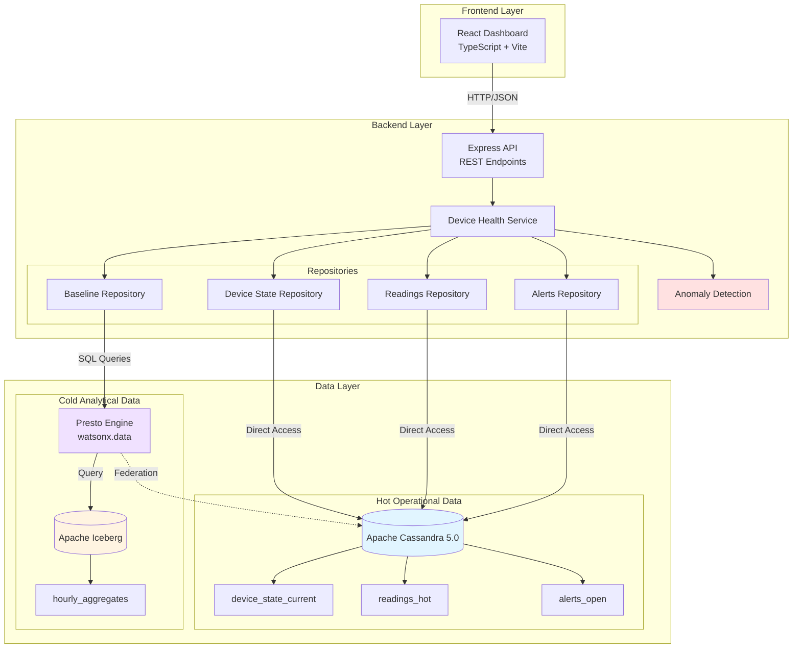
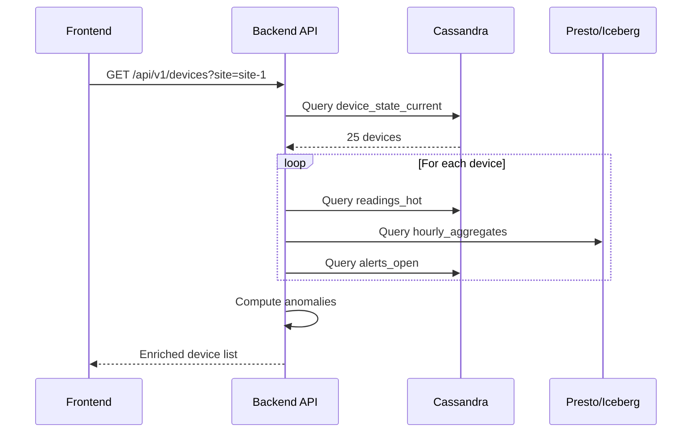
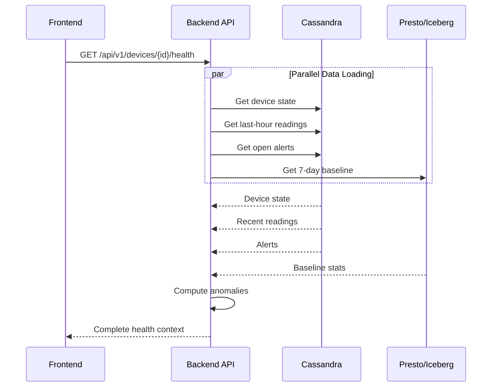
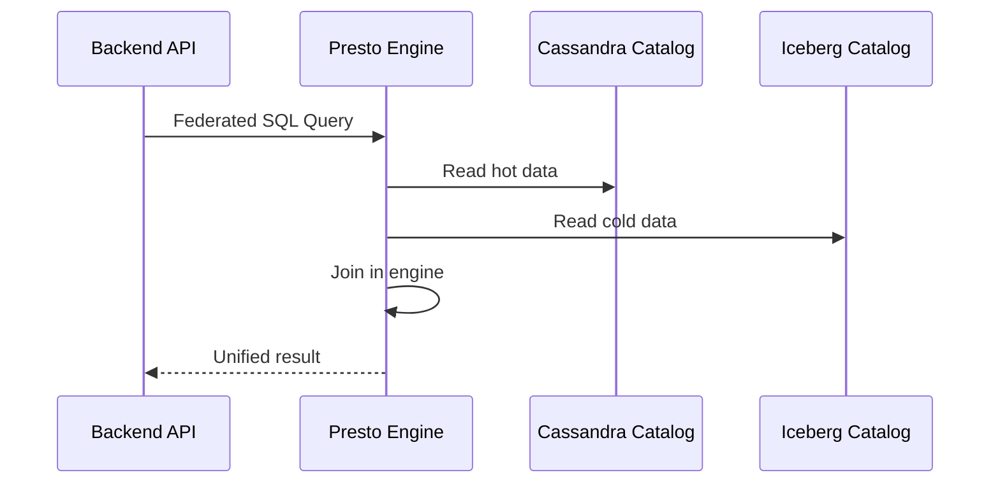

# Architecture Overview

The Sensor Health Dashboard demonstrates a **federated data architecture** that combines hot operational data from Apache Cassandra with cold analytical data from Apache Iceberg, unified through IBM watsonx.data's Presto engine.

## System Architecture



## Technology Stack

### Frontend

| Component | Technology | Purpose |
|-----------|-----------|---------|
| **Framework** | React 18 | UI component library |
| **Language** | TypeScript | Type-safe development |
| **Build Tool** | Vite | Fast development server |
| **Routing** | React Router | Client-side navigation |
| **Styling** | CSS Modules | Component-scoped styles |

### Backend

| Component | Technology | Purpose |
|-----------|-----------|---------|
| **Runtime** | Node.js 18+ | JavaScript server |
| **Framework** | Express | REST API framework |
| **Language** | TypeScript | Type-safe development |
| **Cassandra Client** | cassandra-driver | Direct Cassandra access |
| **HTTP Client** | node-fetch | Presto API calls |
| **Logging** | Pino | Structured logging |
| **Testing** | Vitest | Unit and integration tests |

### Data Layer

| Component | Technology | Purpose |
|-----------|-----------|---------|
| **Hot Store** | Apache Cassandra 5.0 | Operational data (device state, readings, alerts) |
| **Cold Store** | Apache Iceberg | Historical analytics (aggregates, baselines) |
| **Query Engine** | Presto (watsonx.data) | Unified SQL interface |
| **Federation** | Presto Catalogs | Cross-source queries |

## Data Flow Patterns

### Pattern 1: Dashboard List (Application-Side Join)



**Why application-side joins?**

- Enables graceful degradation when Presto is slow
- Keeps hot reads fast via direct Cassandra access
- Supports complex anomaly logic beyond SQL
- Better performance for bounded scopes (25 devices)

### Pattern 2: Device Detail (Parallel Queries)



**Benefits:**

- Minimizes total latency through parallelization
- Provides complete context in single response
- Supports partial enrichment on failures

### Pattern 3: Federated Query (Optional)



**When to use:**

- Analytical queries across large datasets
- Complex aggregations spanning hot and cold
- When application-side join overhead is high

**When NOT to use:**

- Bounded scopes (single device, small pages)
- Real-time operational reads
- When graceful degradation is critical

## Key Design Decisions

### 1. Application-Side Joins for Bounded Scopes

**Decision:** Use application-side joins for single-device and paginated list views.

**Rationale:**

- Dashboard shows 25 devices per page (bounded scope)
- Device detail is single-device (bounded scope)
- Parallel queries faster than federated SQL on Apple Silicon
- Enables graceful degradation when Presto is slow
- Anomaly logic too complex for SQL

See [Federated Query Analysis](federated-query-analysis.md) for detailed analysis.

### 2. Direct Cassandra Access for Hot Reads

**Decision:** Query Cassandra directly, not through Presto federation.

**Rationale:**

- Hot operational reads should be fast (<100ms)
- Presto adds latency (connection overhead, query planning)
- Direct access enables efficient partition key lookups
- Preserves Cassandra's low-latency guarantees

### 3. Presto for Cold Analytics Only

**Decision:** Use Presto exclusively for Iceberg queries and optional federation.

**Rationale:**

- Iceberg has no direct query interface (requires Presto)
- Presto excels at analytical queries over large datasets
- Federation useful for complex analytics, not operational reads
- Keeps hot and cold access patterns separate

### 4. No Automatic Retries

**Decision:** Fail fast for both hot reads and slow analytics.

**Rationale:**

- Hot reads should be fast - retries add latency
- Slow analytics (15-25s on Apple Silicon) - retries compound delays
- Graceful degradation preferred over blocking retries
- Structured errors enable client-side retry logic

See [Observability](../development/observability.md) for implementation details.

### 5. Composite Health Endpoint

**Decision:** Single `/devices/:id/health` endpoint instead of multiple calls.

**Rationale:**

- Reduces client-side complexity (1 call vs. 4)
- Enables parallel data loading on backend
- Provides complete investigation context
- Supports partial enrichment on failures

## Data Model

### Hot Operational Data (Cassandra)

```
iot.device_state_current
├── device_id (UUID, PRIMARY KEY)
├── device_type, device_class, model
├── firmware_version
├── status (online/offline/degraded/maintenance)
├── last_heartbeat (timestamp)
├── battery_percent, signal_strength_dbm
├── site_id, zone
└── installed_at, updated_at

iot.readings_hot
├── (device_id, reading_bucket_hour) PRIMARY KEY
├── reading_timestamp (CLUSTERING)
├── metric_name, metric_value, unit
└── quality_code (good/suspect/bad)

iot.alerts_open
├── device_id (PARTITION KEY)
├── alert_id (CLUSTERING)
├── raised_at, severity, alert_type
├── metric_name, metric_value, threshold_value
└── acknowledged (boolean)
```

### Cold Analytical Data (Iceberg)

```
iceberg_data.iot.hourly_aggregates
├── device_id (VARCHAR)
├── site_id, device_class
├── metric_name
├── hour_start (TIMESTAMP)
├── sample_count
├── min_value, max_value, avg_value
├── p95_value, stddev_value
└── Partitioned by: year(hour_start), month(hour_start)
```

See [Data Model](data-model.md) for complete schemas.

## Scalability Considerations

### Current Scope (Starter App)

- **Dashboard:** 25 devices per page
- **Enrichment:** Parallel queries per device
- **Baseline:** 7-day window
- **Target:** Workshop demo, not production scale

### Production Considerations

For 10,000+ device fleets:

1. **Caching layer** for baseline data (Redis/Memcached)
2. **Materialized views** for common aggregations
3. **Batch enrichment** for dashboard lists
4. **Streaming updates** for real-time metrics
5. **Horizontal scaling** of backend services

## Performance Characteristics

### Expected Latencies

| Operation | Cassandra | Presto/Iceberg | Notes |
|-----------|-----------|----------------|-------|
| Device lookup | <10ms | N/A | Direct partition key |
| Last-hour readings | <50ms | N/A | Two bucket queries |
| Open alerts | <20ms | N/A | Partition key lookup |
| 7-day baseline | N/A | 5-25s | Depends on hardware |
| Dashboard page | <2s | N/A | 25 devices + enrichment |
| Device detail | <3s | N/A | Parallel queries |

**Note:** Presto times reflect Apple Silicon (amd64 emulation). Intel/AMD hardware is ~3× faster.

## Next Steps

- [Data Access Patterns](data-access-patterns.md) - Detailed query patterns
- [Federated Query Analysis](federated-query-analysis.md) - Join strategy rationale
- [API Design](api-design.md) - REST endpoint specifications
- [Data Model](data-model.md) - Complete schema reference