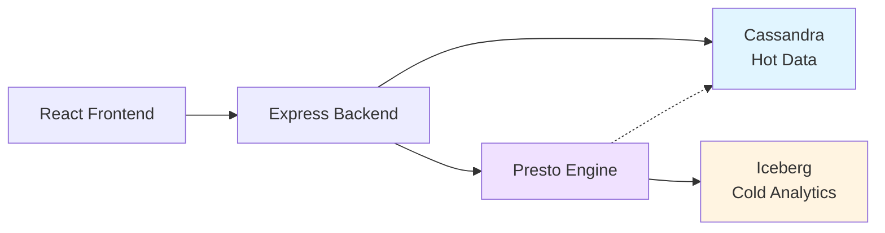

# Overview

The **Sensor Health Dashboard** is a full-stack IoT device monitoring application that demonstrates federated analytics across hot operational data and cold historical data using IBM watsonx.data.

## What You'll Build

This application showcases:

- **Real-time device monitoring** with status, battery, and signal strength
- **Anomaly detection** comparing recent readings against historical baselines
- **Alert management** for critical device conditions
- **Fleet-wide visibility** with filtering and prioritization
- **Federated data access** across Cassandra (hot) and Iceberg (cold)

## Prerequisites

Before you begin, ensure you have:

- **Workshop Environment** installed (IBM watsonx.data + Apache Cassandra)
- **Node.js 18+** and npm
- **Sample IoT data** loaded into the environment

See the [Installation Guide](installation.md) for detailed setup instructions.

## Architecture at a Glance

The application uses:

- **Direct Cassandra access** for hot operational reads (device state, recent readings, alerts)
- **Presto queries** for cold analytical data (7-day baselines, aggregates)
- **Application-side joins** for bounded scopes with graceful degradation

## Key Features

### For Operations Teams

- **Dashboard view** showing fleet health at a glance
- **Anomaly indicators** highlighting unusual device behavior
- **Alert context** surfacing critical conditions
- **Site filtering** for focused monitoring

### For Developers

- **Spec-coding methodology** with complete requirements and design docs
- **90 automated tests** with 100% requirement coverage
- **Comprehensive API** with OpenAPI specification
- **Observability** with structured logging and query timing

## Next Steps

1. [Quick Start](quick-start.md) - Get the app running in 5 minutes
2. [Installation](installation.md) - Detailed setup instructions
3. [Configuration](configuration.md) - Environment variables and settings

## Learning Resources

- [Spec-Coding Introduction](../spec-coding/introduction.md) - Learn the development methodology
- [Architecture Overview](../architecture/overview.md) - Understand the system design
- [API Reference](../api/overview.md) - Explore the REST API