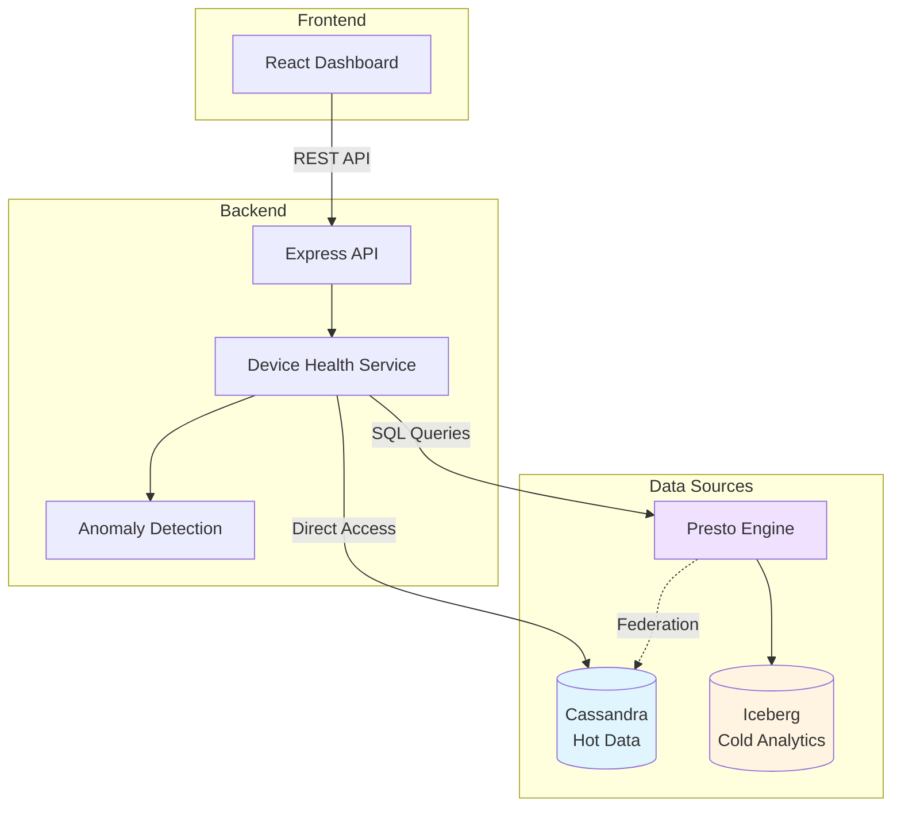

# Sensor Health Dashboard

-   :material-clock-fast:{ .lg .middle } __Quick Start__

    ---

    Get up and running in minutes with our comprehensive quick start guide.

    [:octicons-arrow-right-24: Quick Start](getting-started/quick-start.md)

-   :material-book-open-variant:{ .lg .middle } __Spec-Coding Methodology__

    ---

    Learn how this application was built using AI-driven spec-coding.

    [:octicons-arrow-right-24: Learn More](spec-coding/introduction.md)

-   :material-api:{ .lg .middle } __API Reference__

    ---

    Complete REST API documentation with examples and schemas.

    [:octicons-arrow-right-24: API Docs](api/overview.md)

-   :material-chart-line:{ .lg .middle } __Architecture__

    ---

    Understand the federated data architecture and design decisions.

    [:octicons-arrow-right-24: Architecture](architecture/overview.md)

---

## Overview

The **Sensor Health Dashboard** is a full-stack IoT device monitoring application that demonstrates federated analytics across hot operational data (Apache Cassandra) and cold historical data (Apache Iceberg) using IBM watsonx.data.

### What This Application Does

The dashboard helps operations teams monitor IoT device fleets by:

- **Real-time monitoring** of device status, battery levels, and signal strength
- **Anomaly detection** comparing recent readings against 7-day historical baselines
- **Alert management** surfacing open critical/high/medium/low severity alerts
- **Fleet-wide visibility** with filtering by site, status, and anomaly state
- **Device investigation** providing complete health context in a single view

### Key Features

:white_check_mark: **Hot operational reads** from Cassandra (device state, last-hour readings, open alerts)  
:white_check_mark: **Cold analytical queries** from Iceberg via Presto (7-day baseline statistics)  
:white_check_mark: **Intelligent anomaly detection** using P95 thresholds and standard deviation rules  
:white_check_mark: **Graceful degradation** when data sources are unavailable  
:white_check_mark: **Comprehensive observability** with request tracing and query timing

---

## Technology Stack

=== "Backend"

    - **Runtime:** Node.js + TypeScript + Express
    - **Hot Data:** Direct Cassandra access for operational data
    - **Analytics:** Presto/watsonx.data for Iceberg queries
    - **Logging:** Structured logging with Pino

=== "Frontend"

    - **Framework:** React + TypeScript + Vite
    - **Routing:** React Router for navigation
    - **UI:** Responsive dashboard and detail views

=== "Data Layer"

    - **Apache Cassandra 5.0** - Hot operational data (device state, readings, alerts)
    - **Apache Iceberg** - Historical analytical data (hourly aggregates, baselines)
    - **IBM watsonx.data** - Unified query engine (Presto) with catalog federation

---

## Architecture Highlights

### Design Decision: Application-Side Joins

The application uses **application-side joins** for bounded scopes (single device or 25-device pages) rather than federated Presto queries. This enables:

- Graceful degradation when Presto is slow or unavailable
- Fast hot operational reads via direct Cassandra access
- Complex anomaly logic that's too sophisticated for SQL
- Better performance on Apple Silicon (amd64 emulation)

See [Federated Query Analysis](architecture/federated-query-analysis.md) for detailed rationale.

---

## Spec-Coding Methodology

This application was built using **spec-coding** methodology, where an AI coding agent (Claude Code) drove the entire implementation from specifications to production-ready code.

### The Workflow

1. **Requirements First** - 11 functional requirements defined upfront
2. **Technical Design** - Data access patterns and API contracts specified
3. **Sprint Planning** - 32 tickets across 4 sprints with acceptance criteria
4. **AI-Driven Implementation** - Agent generated code with 90 automated tests
5. **Verification** - 100% requirement coverage with traceability matrix

### Why It Works

:white_check_mark: **Clear requirements** → No scope creep, focused implementation  
:white_check_mark: **Upfront design** → Consistent architecture, no major refactors  
:white_check_mark: **Test-driven** → 90/90 tests passing, high confidence  
:white_check_mark: **Traceable** → Every line of code maps to a requirement  
:white_check_mark: **Documented** → Comprehensive docs generated during development

Learn more about the [Spec-Coding Methodology](spec-coding/introduction.md).

---

## Quick Links

-   :material-rocket-launch:{ .lg .middle } __Get Started__

    [:octicons-arrow-right-24: Installation Guide](getting-started/installation.md)

-   :material-test-tube:{ .lg .middle } __Testing__

    [:octicons-arrow-right-24: Test Documentation](development/testing.md)

-   :material-alert-circle:{ .lg .middle } __Troubleshooting__

    [:octicons-arrow-right-24: Getting Unstuck](operations/troubleshooting.md)

-   :material-github:{ .lg .middle } __Source Code__

    [:octicons-arrow-right-24: GitHub Repository](https://github.com/dwakeman/spec-coding-iot-app)

---

## Project Status

| Metric | Status |
|--------|--------|
| **Requirements** | 11/11 implemented ✅ |
| **Tests** | 90/90 passing ✅ |
| **Backend Tests** | 84 tests ✅ |
| **Frontend Tests** | 6 tests ✅ |
| **Demo Readiness** | Ready ✅ |
| **Documentation** | Complete ✅ |

---

## License

This project is licensed under the Apache License 2.0 - see the [LICENSE](https://github.com/dwakeman/spec-coding-iot-app/blob/main/LICENSE) file for details.

---

**Built with spec-coding methodology using IBM Bob (Claude Code) • 2026**