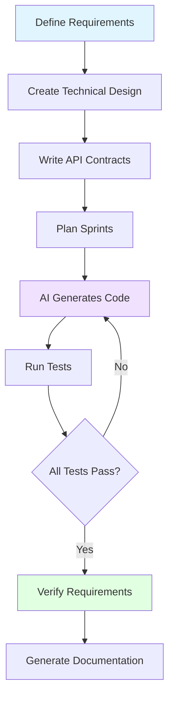

# Spec-Coding Methodology

## What is Spec-Coding?

**Spec-coding** is a development methodology where specifications drive implementation through AI-assisted coding. Instead of writing code first and documenting later, you define requirements, design, and contracts upfront—then let an AI coding agent generate the implementation.

This project demonstrates spec-coding in action, with every line of code traceable back to a requirement.

## The Spec-Coding Workflow

## Why Spec-Coding Works

### Traditional Development Challenges

❌ **Scope creep** - Requirements evolve during implementation  
❌ **Inconsistent architecture** - Design decisions made ad-hoc  
❌ **Poor test coverage** - Tests written after code, if at all  
❌ **Outdated documentation** - Docs lag behind implementation  
❌ **Unclear traceability** - Hard to map code to requirements

### Spec-Coding Solutions

✅ **Clear requirements** → No scope creep, focused implementation  
✅ **Upfront design** → Consistent architecture, no major refactors  
✅ **Test-driven** → Tests defined with requirements, high confidence  
✅ **Living documentation** → Docs generated during development  
✅ **Complete traceability** → Every line maps to a requirement

## The Five Phases

### 1. Requirements Definition

Start with **functional requirements** that describe what the system must do.

**For this project:**

- 11 functional requirements (REQ-001 through REQ-011)
- 3 user personas (Operations Analyst, Site Reliability Lead, Support Engineer)
- 3 primary user flows
- Clear acceptance criteria per requirement

See [Requirements](requirements.md) for the complete specification.

### 2. Technical Design

Create a **design document** that specifies:

- Architecture and component structure
- Data access patterns
- API contracts
- Technology choices
- Design decisions with rationale

**For this project:**

- Application-side joins vs. federated queries
- Direct Cassandra access for hot reads
- Presto for cold analytics
- Anomaly detection algorithms
- Error handling strategies

See [Design](design.md) for the complete technical design.

### 3. API Contracts

Define the **API surface** before implementation:

- Endpoints and HTTP methods
- Request/response schemas
- Error codes and messages
- Data models

**For this project:**

- OpenAPI 3.1 specification
- 7 REST endpoints
- Comprehensive data models
- Structured error responses

See [API Design](../architecture/api-design.md) for details.

### 4. Sprint Planning

Break work into **concrete tickets** with:

- Clear scope per ticket
- Acceptance criteria
- Requirement mapping
- Definition of done

**For this project:**

- 32 tickets across 4 sprints
- Each ticket maps to specific requirements
- Test coverage defined per ticket
- Progressive implementation strategy

See [Sprint Planning](sprint-planning.md) for the complete board.

### 5. AI-Driven Implementation

Let the **AI coding agent** generate:

- Production code
- Automated tests
- Documentation
- Configuration

**For this project:**

- Claude Code (IBM Bob) as the agent
- 90 automated tests (84 backend, 6 frontend)
- 100% requirement coverage
- Comprehensive inline documentation

## Benefits Demonstrated

### Development Speed

- **Faster initial implementation** - Agent writes boilerplate and structure
- **Fewer refactors** - Design decisions made upfront
- **Parallel work** - Specs enable multiple agents/developers

### Code Quality

- **Consistent patterns** - Design enforced across codebase
- **High test coverage** - Tests defined with requirements
- **Better error handling** - Edge cases considered upfront

### Maintainability

- **Clear intent** - Requirements explain the "why"
- **Traceable changes** - Every feature maps to a requirement
- **Living documentation** - Specs stay current with code

### Team Collaboration

- **Shared understanding** - Specs provide common language
- **Easier onboarding** - New developers read specs first
- **Better reviews** - Code reviewed against specs

## Key Artifacts

This project includes all spec-coding artifacts:

| Artifact | Purpose | Location |
|----------|---------|----------|
| Requirements | What to build | [requirements.md](requirements.md) |
| Design | How to build it | [design.md](design.md) |
| API Contract | Interface specification | [openapi.yaml](../api/openapi.yaml) |
| Sprint Board | Work breakdown | [sprint-planning.md](sprint-planning.md) |
| Traceability Matrix | Test coverage | [requirements-traceability.md](../reference/requirements-traceability.md) |
| Final Report | Verification | [final-report.md](../reference/final-report.md) |

## Lessons Learned

### What Worked Well

✅ **Requirements-first approach** prevented scope creep  
✅ **Upfront design** eliminated major refactors  
✅ **Test-driven development** caught issues early  
✅ **AI code generation** accelerated implementation  
✅ **Continuous verification** maintained quality

### Challenges Encountered

⚠️ **Initial spec refinement** took multiple iterations  
⚠️ **Agent context limits** required breaking work into chunks  
⚠️ **Test data generation** needed manual verification  
⚠️ **Performance tuning** required human judgment

### Best Practices

1. **Start with clear requirements** - Invest time upfront
2. **Design before coding** - Architecture decisions matter
3. **Define tests early** - Know what success looks like
4. **Iterate on specs** - Refine before implementation
5. **Verify continuously** - Run tests after every change
6. **Document decisions** - Capture the "why" not just "what"

## Applying Spec-Coding to Your Project

### Getting Started

1. **Define your requirements** - What must the system do?
2. **Identify your personas** - Who will use it?
3. **Map user flows** - How will they use it?
4. **Write acceptance criteria** - How will you know it works?

### Tools and Techniques

- **Requirements management** - Use structured documents
- **API-first design** - Define contracts before implementation
- **Test-driven development** - Write tests with requirements
- **AI coding assistants** - Let agents handle boilerplate
- **Continuous verification** - Automate requirement checking

### Success Metrics

- **Requirement coverage** - Every requirement has tests
- **Test pass rate** - All tests should pass
- **Documentation completeness** - Specs match implementation
- **Traceability** - Code maps to requirements

## Next Steps

Ready to try spec-coding yourself?

1. **Study this project** - See how it was built
2. **Read the artifacts** - Understand the methodology
3. **Run the tests** - Verify the implementation
4. **Extend the features** - Add your own requirements

---

**Learn More:**

- [Requirements Specification](requirements.md)
- [Technical Design](design.md)
- [Sprint Planning](sprint-planning.md)
- [Verification Results](verification.md)